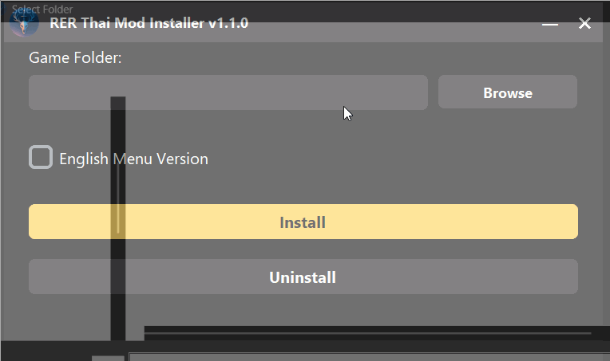

# The Witcher 3 mod Random Encounters Reworked - Thai version

 
More Images

**English** | [ไทย](/docs/README-TH.md)

  
  
  
  

-----------

💬 The Witcher 3 mod Random Encounters Reworked - Thai version.

This mod provides Thai localization for the [Random Encounters Reworked](https://www.nexusmods.com/witcher3/mods/5018) mod, allowing Thai players to fully enjoy the enhanced random encounters experience!

Original Mod: [Random Encounters Reworked](https://www.nexusmods.com/witcher3/mods/5018) by Aelto ([GitHub](https://github.com/Aelto/tw3-random-encounters-reworked))

## 📝 Features / Changelog

**✨ v1.1.0 (Latest Update):**

- ✅ **Added Choice:** Option to choose between "English Menu" version (original behavior for settings menu) and "Full Thai" version (all menus in Thai).
- ✅ **Added Mod Installer:** For easy installation and version selection.
- 🛠️ **Translation Fix:** Corrected hardcoded navigation marker "Bounty Master" from the Random Encounters Reworked mod.

**v1.0.0:**

- Provided Thai translation for the Random Encounters Reworked mod (Settings menu text remained in English).
- Fixed hardcoded text in the "Surrounding Ecosystem" feature of the Random Encounters Reworked mod.
- Added Thai translation for the "Surrounding Ecosystem" feature.

## ❗ Prerequisites

- 🔗 You must have the original [Random Encounters Reworked (Next Gen)](https://www.nexusmods.com/witcher3/mods/5018) mod by Aelto installed.
  - Original mod's GitHub: [GitHub](https://github.com/Aelto/tw3-random-encounters-reworked)

## ⚙️ Installation

You can choose between two installation methods:
📥 Download all necessary files from the latest release [HERE](https://github.com/Onyx-Nostalgia/tw3-random-encounters-reworked-thai/releases/latest).

### 💻 Mod Installer (Recommended 👍)

  

   1. 🔗 Download the Mod Installer: [RER-Thai-Mod-Installer-1.1.0.zip](https://github.com/Onyx-Nostalgia/tw3-random-encounters-reworked-thai/releases/latest/download/RER-Thai-Mod-Installer-1.1.0.zip)
   2. 📦 Extract the archive and run **RERThaiInstaller.exe**.
   3. In the installer:
      - 📁 Select your The Witcher 3 game installation folder.
      - ✔️ Choose if you want the _English Menu Version_ (settings menu in English, other texts in Thai) or the _Full Thai Version_ (all texts in Thai).
   4. 🚀 Click Install. The program will automatically install the mod.
   5. 🎮 Launch The Witcher 3 and change the in-game language to **"ไทย (เต็มรูปแบบ)"**.

### 🖐️ Manual Installation

   1. 🔗 Download the manual installation files: [tw3-random-encounters-reworked-thai-1.1.0.zip](https://github.com/Onyx-Nostalgia/tw3-random-encounters-reworked-thai/releases/latest/download/tw3-random-encounters-reworked-thai-1.1.0.zip)
   2. 📦 Extract the downloaded .zip file. You will find the following folders:
      - `mod0RandomEncountersReworked_TH_full` (for Full Thai version)
      - `mod0RandomEncountersReworked_TH_(en_menu)` (for English menu with Thai content)
      - `modRemoteEncountersReworked` (contains patched script files in `content/scripts/`)
   3. 👉 **Choose only ONE folder** from either `mod0RandomEncountersReworked_TH_full` or `mod0RandomEncountersReworked_TH_(en_menu)` and place it into your The Witcher 3 `mods` directory.
      - Example path: `C:\Program Files (x86)\Steam\steamapps\common\The Witcher 3\mods`
   4. ⚠️ **Important:** Backup your existing `mods\modRemoteEncountersReworked` folder (from your original Random Encounters Reworked mod installation) before proceeding.
        - ➡️ Take the contents of the `modRemoteEncountersReworked` folder (from the files you just downloaded for this Thai mod) and use them to **overwrite** the existing files in your game's `mods\modRemoteEncountersReworked` directory (specifically the `content/scripts/` within it).
   5. 🎮 Launch The Witcher 3 and change the in-game language to **"ไทย (เต็มรูปแบบ)"**.
